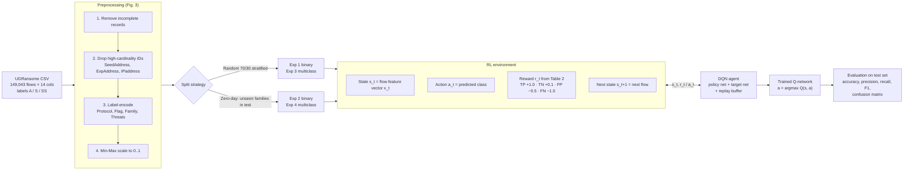
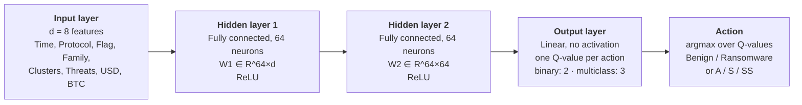
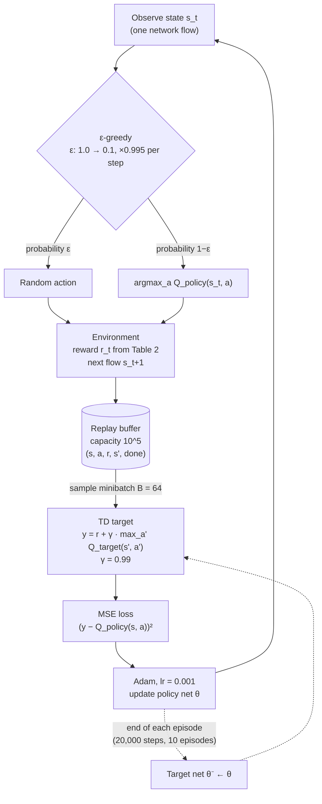
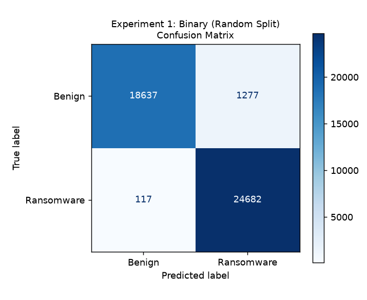
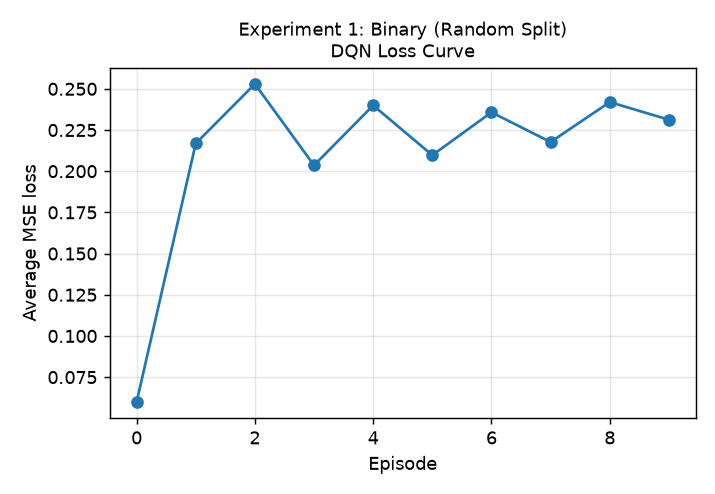
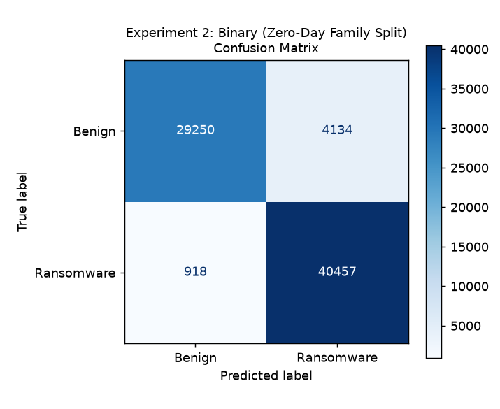
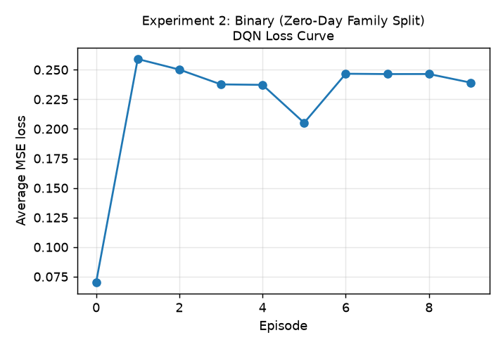
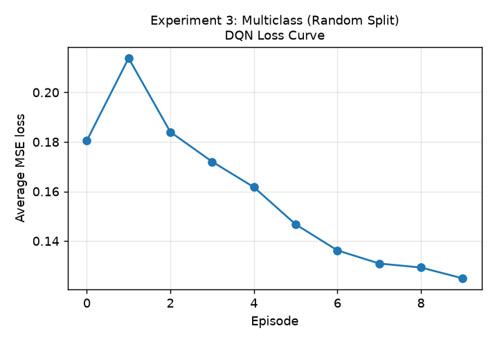
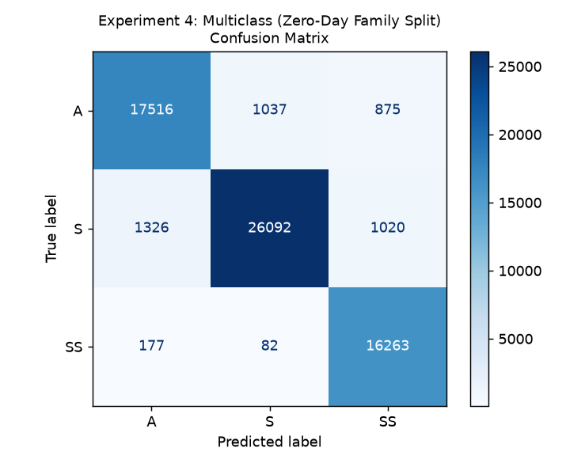
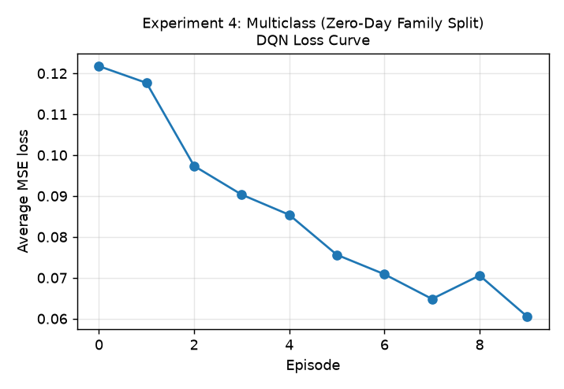

# Self-Adaptive IDS for Zero-Day Attacks Using Deep Q-Networks — reproduction

A from-scratch PyTorch reproduction of

> M. Alkasassbeh, E. H. Omoush, M. Almseidin, A. Aldweesh,
> **"A Self-Adaptive Intrusion Detection System for Zero-Day Attacks Using Deep Q-Networks"**,
> *IEEE Access*, vol. 13, pp. 174280–174296, 2025. doi:10.1109/ACCESS.2025.3617792

The paper treats network-flow classification on the UGRansome dataset as a reinforcement-learning
problem. Each flow is a state, the predicted class is the action, and an asymmetric reward penalises
missed ransomware. A DQN agent learns the policy. The paper has no public code, so everything here
follows the description in the paper.

## Architecture of the proposed DQN-based IDS

The diagrams below show the paper's method at three levels: the end-to-end pipeline, the
Q-network layers, and the DQN training loop (Algorithm 1). They render on GitHub. PNG copies are in
`docs/` ([pipeline](docs/pipeline.png), [layers](docs/q_network_layers.png), [training loop](docs/dqn_training_loop.png)).

### 1. End-to-end pipeline (paper Sec. IV, Fig. 3, Fig. 4)



### 2. Q-network layers (paper Eq. 2, Sec. IV-A)

`Q(s) = W3 · ReLU(W2 · ReLU(W1 · s + b1) + b2) + b3`



| Layer | Type | Shape | Activation | Parameters (d = 8, binary) |
|---|---|---|---|---|
| Input | flow feature vector | d = 8 | – | – |
| Hidden 1 | Linear | d → 64 | ReLU | 8·64 + 64 = 576 |
| Hidden 2 | Linear | 64 → 64 | ReLU | 64·64 + 64 = 4,160 |
| Output | Linear | 64 → \|A\| (2 or 3) | identity | 64·2 + 2 = 130 (multiclass 195) |
| **Total** | | | | **4,866** (multiclass 4,931) |

The target network Q(s, a; θ⁻) is an identical copy of these layers. Its weights are copied from
the policy network at the end of every episode.

### 3. DQN training loop (paper Eq. 1, Algorithm 1, Table 3)



## Quick start

```bash
pip install -r requirements.txt
python run_experiments.py                       # all 4 experiments × 5 seeds (~25 min on 4 CPU cores)
python run_experiments.py --exp 2 --seeds 0     # a single run
```

Outputs are written to `results/`:

| File | Content |
|---|---|
| `summary.md` / `summary.json` | paper vs. reproduced accuracy / F1 for every experiment and seed |
| `expN_confusion_matrix.png` | confusion matrix of the best seed (paper Fig. 6, 7, 9, 11) |
| `expN_loss_curve.png` | mean TD loss per episode (paper Fig. 5, 8, 10, 12) |
| `expN_classification_report.txt` | precision / recall / F1 / support (paper Tables 4–7) |

## Repository layout

```
data/ugransome_final2.csv   UGRansome "final(2).csv" (149,043 flows × 14 columns)
dqn_ids/data.py             preprocessing + random / zero-day splits
dqn_ids/env.py              classification-as-RL environment + reward tables
dqn_ids/agent.py            Q-network, replay buffer, DQN agent, Algorithm 1 training loop
run_experiments.py          runs Exp 1–4, writes metrics and figures
```

## What was implemented (mapping to the paper)

| Paper | Implementation |
|---|---|
| Dataset: UGRansome, 149,043 flows, labels A / S / SS (Table 1, Fig. 1) | `data/ugransome_final2.csv`, the Kaggle `final(2).csv`. Label counts match exactly: S = 66,380, A = 42,561, SS = 40,102 |
| Remove incomplete records; drop `SeedAddress`, `ExpAddress`, `IPaddress`; label-encode `Protocol`, `Flag`, `Family`, `Threats`; Min-Max to [0, 1] (Sec. IV-A, Fig. 3) | `dqn_ids/data.py` |
| Features: Time, Protocol, Flag, Family, Clusters, Threats, USD, BTC (Table 1) | default `--features table1`; `--features all` also keeps `Netflow_Bytes` and `Port` |
| Binary: S = benign, A + SS = ransomware | `task="binary"` |
| Random 70/30 stratified split (Exp 1, 3) | `train_test_split(..., stratify=Prediction)`. The test set has 44,713 rows, matching the paper |
| Zero-day family split (Exp 2, 4) | see below |
| Reward TP +1.0, TN +0.1, FP −0.5, FN −1.0 (Table 2) | `env.BINARY_REWARD` |
| MLP d → 64 → 64 → \|A\|, ReLU, linear output (Eq. 2) | `agent.QNetwork` |
| Policy + target network; target synced at the end of each episode | `DQNAgent.update_target()` |
| lr 0.001, γ 0.99, batch 64, 10 episodes × 20,000 steps, ε 1.0 → 0.1 with ×0.995 decay per step, MSE, replay 10⁵, Adam (Table 3) | `agent.DQNConfig` |
| Algorithm 1: ε-greedy act → reward → s′ = next sample → store → sample minibatch → TD target → MSE update → decay ε | `agent.train()` |

### Recovering the zero-day family splits

The paper says ransomware families were split 70/30 into disjoint train and test sets. It does not
say which families went where, but it does report the exact test-set supports. I enumerated all
2¹⁷ subsets of the 17 families. In each case exactly one subset matches the reported supports, so
the splits below should be identical to the paper's:

| Experiment | Held-out (test) families | Test support (paper = reproduced) |
|---|---|---|
| Exp 2, binary | Cryptohitman, DMALocker, JigSaw, Locky, TowerWeb, WannaCry | 74,759 (Benign 33,384 / Ransomware 41,375) |
| Exp 4, multiclass | APT, EDA2, Globe, JigSaw, Razy, SamSam | 64,388 (A 19,428 / S 28,438 / SS 16,522) |

In both cases 6 of the 17 families (≈ 30 %) are held out.

### Choices the paper leaves open

| Item | Default used here | Option |
|---|---|---|
| Multiclass reward (only "positive if correct, negative otherwise") | +1 correct / −1 wrong | `--multiclass-reward asymmetric` (Table 2 generalised to 3 classes) |
| Order of samples within an episode | 20,000 flows drawn uniformly from the training set | – |
| Min-Max scaler fit | training split only (no test leakage) | `--scale-on all` |
| Feature set | Table 1 (8 features) | `--features all` (10 features) |
| Seeds / "best run" | the paper reports its best run; we report the best seed **and** the mean ± std over seeds | `--seeds` |

## Results

Default configuration (Table 3 hyperparameters, Table 1 features, scaler fit on train), seeds 0–2.
Regenerate with `python run_experiments.py --seeds 0 1 2`. Every number below is in `results/`.

| Exp | Setting | Paper accuracy | Reproduced, best seed | Reproduced, mean ± std | Paper macro-F1 | Reproduced macro-F1 |
|---|---|---|---|---|---|---|
| 1 | Binary (Random Split) | 97.6% | 96.9% | 96.7% ± 0.2% | 0.98 | 0.97 |
| 2 | Binary (Zero-Day Family Split) | 95.9% | 91.3% | 90.6% ± 0.7% | 0.96 | 0.91 |
| 3 | Multiclass (Random Split) | 97.0% | 97.2% | 97.0% ± 0.1% | 0.97 | 0.97 |
| 4 | Multiclass (Zero-Day Family Split) | 92.0% | 94.0% | 93.6% ± 0.5% | 0.92 | 0.94 |

### Per-class recall (best seed)

| Exp | Paper | Reproduced |
|---|---|---|
| 1 | Benign 0.95 / Ransomware 1.00 | Benign 0.94 / Ransomware 1.00 |
| 2 | Benign 0.93 / Ransomware 0.99 | Benign 0.84 / Ransomware 0.97 |
| 3 | A 0.94 / S 0.97 / SS 0.99 | A 0.96 / S 0.98 / SS 0.98 |
| 4 | A 0.90 / S 0.89 / SS 0.99 | A 0.91 / S 0.94 / SS 0.98 |

### Confusion matrices (rows = true, cols = predicted)

| Exp | Paper | Reproduced (best seed) |
|---|---|---|
| 1 | `[[18893, 1021], [65, 24734]]` | `[[18637, 1277], [117, 24682]]` |
| 2 | `[[30891, 2493], [570, 40805]]` | `[[28027, 5357], [1122, 40253]]` |
| 3 | `[[12050, 450, 268], [416, 19238, 260], [42, 49, 11940]]` | `[[12241, 422, 105], [403, 19451, 60], [127, 147, 11757]]` |
| 4 | `[[17511, 1131, 786], [1723, 25392, 1323], [76, 47, 16399]]` | `[[17631, 1116, 681], [1187, 26648, 603], [204, 77, 16241]]` |

### Figures

| | Confusion matrix | Loss curve |
|---|---|---|
| Exp 1 |  |  |
| Exp 2 |  |  |
| Exp 3 |  |  |
| Exp 4 |  |  |

### Discussion

- **Exp 1 and Exp 3 (random splits) reproduce.** Accuracy is within 0.7 pts of the paper, and the confusion matrices have the same structure. In binary, the asymmetric reward pushes ransomware recall to ≈1.00 at the cost of ~1,000 false positives, as in the paper's Fig. 6.
- **The loss curves match the paper's shape.** In the binary experiments the TD loss jumps from ≈0.07 to ≈0.25 after the first target-network sync and then plateaus (paper Fig. 5/8). This comes from the γ = 0.99 bootstrap. In multiclass the loss decreases monotonically, as in Fig. 10/12.
- **Exp 4 (multiclass zero-day)** is about 2 pts *above* the paper (94.0 % vs 92.0 %). SS recall is 0.98 (paper 0.99), and S is the hardest class, as in the paper.
- **Exp 2 (binary zero-day) is the one gap.** It reaches 91 % vs the paper's 95.9 %. The pattern is the same (ransomware recall 0.97 vs 0.99), but more held-out benign flows are flagged as ransomware (benign recall 0.84 vs 0.93). Single DQN runs on this split vary by about ±1 pt across seeds. The paper reports its best run, and seeds or unreported details (sample order, scaler fit, reward for the multiclass case) can plausibly explain the rest.

## Notes

- **Dataset source.** Kaggle (`nkongolo/ugransome-dataset`) is the official host. The copy in
  `data/` is the identical `final(2).csv` (149,043 rows, MD5 `0f08326d264a8ba49825e6af779a3c04`),
  taken from a public GitHub mirror.
- **`Family` is an input feature.** In the zero-day splits, the label-encoded value of an unseen
  family never appears during training. This follows the paper's feature list (Table 1).
- **Hardware.** The paper used an i7-8565U CPU and an MX250 GPU. These runs are CPU-only, at about
  4–5 min per experiment per seed.
