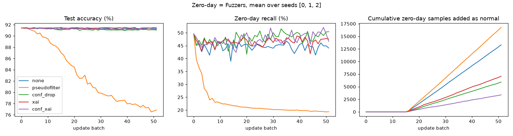
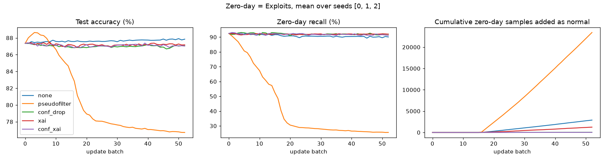

# G1 results: explanation-gated pseudo-labels

All runs were on CPU, with upstream code unmodified (see `../README.md`). Values are
mean ± standard deviation over 3 seeds (0, 1, 2). "Final" is the model at the end of
the stream: no checkpoint is chosen using the test set.

## 1. Reproducing the baselines

### PseudoFilter + MixupAug + LiteAE (Afzaal et al.), upstream code and Config, 5 runs

| | Accuracy | Precision | Recall | F1 |
|---|---|---|---|---|
| Paper | 90.76 | – | – | 91.40 |
| Best batch in each run (upstream's "Best per run" table) | **90.72 ± 0.08** | 94.06 ± 1.15 | 88.78 ± 1.37 | **91.32 ± 0.18** |
| End of the stream (upstream's "Final" table) | **76.21 ± 1.28** | 99.96 ± 0.03 | 56.82 ± 2.33 | **72.43 ± 1.91** |

* The paper's numbers match the **best batch of each run**: the peak test accuracy
  reached at any point of the stream.
* At the end of the stream, accuracy is 14.5 points lower than that peak. Recall
  collapses to 57%, while precision rises to almost 100%.
* The cause is upstream's rule `pseudo[~accept] = 0`: every rejected pseudo-label is
  still added to training, labelled *normal*. Over 50 updates the model learns to call
  more and more attacks normal.
* This happens without any zero-day, in the authors' own setting. Full log:
  `pseudofilter_reproduction.log`.

### AOC-IDS (Zhang et al., INFOCOM 2024)

* Their README command first ran under PyTorch 2.14. It trained all 800 first-round
  epochs, then crashed at the first online update: `utils.evaluate` passes numpy
  floats to `torch.distributions.Normal`, which newer PyTorch rejects (log:
  `aoc_ids_unsw_torch2_crash.log`).
* It is now running unchanged in the environment pinned by its `requirements.txt`
  (Python 3.10, torch 1.13.1, numpy 1.23.5, pandas 1.5.3, scikit-learn 1.2.1,
  scipy 1.10.0).
* Result: *pending; this section will be updated when the run finishes.*

## 2. Zero-day experiment

### Setup

* The zero-day category is removed from the labelled set X0. It enters the stream after
  the first 30% of it.
* Updates come every 2,784 flows; 50 epochs of initial training, 3 epochs per update,
  5% label-flip noise. All of this is the upstream configuration.
* "Label precision" is measured on the labels that entered training, before the
  upstream noise flips.
* "Zero-day added as normal" is poisoning: the share of the stream's zero-day flows
  that entered training labelled benign.

### Fuzzers (hard zero-day: 49.6% recall after initial training)

| Gate | Final acc | Final F1 | Zero-day recall | FPR | Label precision | Stream added | Zero-day added as **normal** | as attack | rejected |
|---|---|---|---|---|---|---|---|---|---|
| none (AOC-IDS rule) | 91.31 ± 0.35 | 92.02 ± 0.32 | 44.09 ± 2.48 | 8.28 ± 0.74 | 88.83 ± 0.18 | 100% | 74.58 ± 0.87 | 25.42 | 0 |
| pseudofilter (upstream) | **76.84 ± 1.32** | 73.36 ± 1.93 | 19.34 ± 0.61 | 0.04 ± 0.04 | 66.47 ± 1.33 | 100% | **94.01 ± 0.58** | 5.99 | 0 |
| conf_drop | 91.04 ± 0.21 | 91.91 ± 0.20 | **50.45 ± 4.73** | 10.63 ± 1.09 | 94.47 ± 0.17 | 77.5% | 33.17 ± 1.10 | 8.22 | 58.61 |
| xai | **91.44 ± 0.35** | **92.19 ± 0.28** | 47.59 ± 1.66 | 8.94 ± 1.06 | 92.30 ± 1.06 | 77.1% | 39.66 ± 6.16 | 18.76 | 41.57 |
| **conf_xai** | 91.15 ± 0.35 | 91.94 ± 0.25 | 46.65 ± 3.77 | 9.55 ± 1.60 | **96.11 ± 0.83** | 63.1% | **18.95 ± 3.76** | 6.96 | 74.09 |

### Exploits (easier zero-day: 92.5% recall after initial training)

| Gate | Final acc | Final F1 | Zero-day recall | FPR | Label precision | Stream added | Zero-day added as **normal** | as attack | rejected |
|---|---|---|---|---|---|---|---|---|---|
| none (AOC-IDS rule) | **87.85 ± 0.54** | **89.33 ± 0.57** | 90.10 ± 2.67 | 17.79 ± 1.18 | 91.92 ± 0.62 | 100% | 8.87 ± 2.34 | 91.13 | 0 |
| pseudofilter (upstream) | **76.72 ± 0.27** | 73.20 ± 0.38 | 25.61 ± 0.72 | 0.03 ± 0.04 | 66.15 ± 2.62 | 100% | **71.69 ± 7.13** | 28.31 | 0 |
| conf_drop | 87.05 ± 0.74 | 88.95 ± 0.63 | 91.96 ± 1.21 | 22.27 ± 0.87 | 99.89 ± 0.03 | 64.7% | 0.09 ± 0.03 | 36.84 | 63.06 |
| xai | 87.17 ± 0.37 | 88.98 ± 0.45 | **92.01 ± 2.88** | 21.40 ± 2.36 | 95.02 ± 1.08 | 78.1% | 3.80 ± 2.31 | 74.16 | 22.04 |
| conf_xai | 87.03 ± 0.77 | 88.88 ± 0.74 | 91.10 ± 3.28 | 21.77 ± 1.66 | **99.91 ± 0.01** | 54.4% | **0.05 ± 0.02** | 31.29 | 68.66 |

## 3. What the results support

1. **PseudoFilter fails as a continual learner.** It loses 11–15 accuracy points in
   every setting we ran: its own benchmark and both zero-day streams. Zero-day recall
   falls to 19–26%. Its published 90.76% is the best checkpoint picked on the test
   set. This is the main motivation for G1: deciding which pseudo-labels enter
   retraining is what makes or breaks the system.
2. **For a hard zero-day (Fuzzers), the explanation gate adds protection on top of
   confidence.**
   * Poisoning falls from 33.2 ± 1.1% (`conf_drop`) to 19.0 ± 3.8% (`conf_xai`), about
     43% fewer poisoned zero-day flows, consistent across all 3 seeds.
   * Label precision rises from 94.5 to 96.1%. Accuracy is unchanged (91.0 vs 91.2).
3. **For an easy zero-day (Exploits), confidence alone is already enough.**
   * Poisoning is 0.09% with `conf_drop` and 0.05% with `conf_xai`, a negligible
     difference.
   * The explanation gate helps where confidence is unreliable, not everywhere.
4. **The explanation gate alone is not a replacement for confidence.** On Fuzzers it
   poisons more than `conf_drop` (39.7 vs 33.2%). It should be framed as a second,
   independent check that is combined with confidence.
5. **Limitation: gating protects but does not teach.**
   * Zero-day recall with `conf_xai` (46.7%) is not higher than with `conf_drop` (50.5%);
     the difference is within the seed spread.
   * 74% of Fuzzers flows are rejected, including correctly labelled ones, so the model
     never learns them as attacks.
   * Turning rejected, explanation-inconsistent samples into a learning signal (a
     novelty buffer, human queries, or DRL-controlled retraining, i.e. gap G2) is the
     natural next step.

## Files

* `summary_tables.md`, `summary_per_run.csv`: tables above; one row per run
* `<ZeroDay>_seed<k>_<gate>.csv`: per-batch logs (row 0 = after initial training)
* `g1_fuzzers.log`, `g1_exploits.log`: console logs
* `pseudofilter_reproduction.log`: upstream PseudoFilter, 5 runs
* `aoc_ids_unsw_torch2_crash.log`: first AOC-IDS attempt (version crash)
* `curves_*.png`: accuracy, zero-day recall and cumulative poisoning per gate
